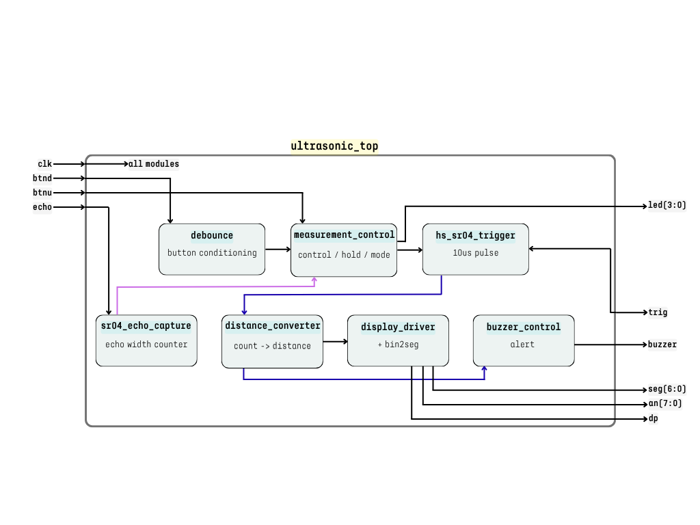

# Ultrasound Distance Meter with HS-SR04 on Nexys A7-50T

This project is developed for the **Digital Electronics** course at **Brno University of Technology (2025/26)**.

The objective of this project is to design and implement a **fully synchronous FPGA-based ultrasonic distance measurement system** using the **HC-SR04 / HS-SR04 sensor** on the **Nexys A7-50T board**, following a **modular and hierarchical Verilog design methodology**.

The system performs real-time distance measurement by generating a trigger signal, capturing the returning echo pulse, and converting the measured time interval into a distance value, which is displayed on the onboard **multiplexed 7-segment display**. Additional outputs such as LEDs and a buzzer provide user feedback and system status indication.

---

## System Principle

The ultrasonic sensor operates based on the **time-of-flight (ToF)** principle.

A short trigger pulse is applied to the sensor, which emits an ultrasonic wave (approximately 40 kHz). This wave reflects from an object and returns to the sensor. The sensor then outputs a digital **echo signal**, whose pulse width is proportional to the total travel time of the wave.

The measured time (t) is related to distance (d) by:

d = (v_sound × t) / 2

where:
- v_sound ≈ 343 m/s (speed of sound in air)
- division by 2 accounts for the forward and return path of the ultrasonic wave

In this implementation, the FPGA measures the echo pulse width in clock cycles and converts it into a distance-related value suitable for display.

---

## System Description

The system is implemented as a **fully synchronous digital design** using a single 100 MHz clock. All modules operate on clock edges, ensuring predictable and stable behavior.

After power-up, the system automatically starts periodic distance measurements. The user can interact with the system using push buttons: one for reset and one for hold functionality. When hold mode is active, the measured distance is frozen and displayed continuously.

The measured distance is shown on the **7-segment display**, while LEDs indicate system states such as active measurement and hold mode. In addition, a **buzzer output** provides acoustic feedback, where the beeping rate increases as the measured distance decreases, similar to automotive parking sensors.

---

## Architecture Overview

The design follows a **hierarchical structure**, where the top-level module `ultrasonic_top` integrates several functional blocks.

The **control logic** manages system behavior, including measurement triggering, hold mode, and synchronization between modules. Push button inputs are processed using a debounce module to eliminate mechanical noise and ensure stable signals.

The **measurement subsystem** interfaces directly with the ultrasonic sensor. A trigger module generates a precise 10 µs pulse, and an echo capture module measures the width of the returning signal using a high-resolution counter. Timeout handling is included to prevent system lock-up when no echo is received.

The **data processing stage** converts the measured counter value into a scaled distance representation using integer arithmetic. This avoids floating-point operations and ensures efficient FPGA resource usage.

The **output subsystem** includes a multiplexed 7-segment display driver, LED indicators, and a buzzer control module. The display driver ensures flicker-free visualization using time-multiplexing, while the buzzer provides distance-dependent acoustic feedback.

---
## Block Diagram

---

## Hardware Platform

The system is implemented on the **Digilent Nexys A7-50T FPGA board**, using the onboard 100 MHz clock source.

The ultrasonic sensor (HC-SR04 / HS-SR04) requires a 5V supply, while FPGA I/O operates at 3.3V. Therefore, proper **level shifting** is required, especially for the echo signal, to ensure safe operation and avoid damage to the FPGA.

The system uses:
- push buttons for user input (reset, hold),
- onboard LEDs for status indication,
- 7-segment display for distance visualization,
- an external buzzer for acoustic feedback.

---

## Implementation Notes

The project is implemented in **Verilog HDL** using **Vivado 2025.2**. The design strictly follows FPGA development best practices, including:

- hierarchical module structure
- synchronous design principles
- avoidance of unintended latch inference
- simulation before hardware implementation
- clean and readable coding style

Clock enable signals are used to generate slower timing events without introducing multiple clock domains. All critical signals are synchronized to the main system clock.

Special care is taken in edge detection and timing measurement to ensure reliable operation of the echo capture mechanism.

---

## Weekly Progress

### Week 1 – Architecture and Planning

During the first week, the foundation of the project was established.

The system requirements were analyzed, and all major design decisions were made. The functionality of the system was clearly defined, including automatic measurement operation, hold mode behavior, LED indicators, and buzzer feedback.

A complete **block diagram** of the system was designed, defining all modules and their interconnections. The internal data flow, control signals, and module responsibilities were carefully planned to ensure a clean and modular architecture.

The Git repository was initialized, and the initial project documentation was created. The structure of the project, including planned modules and development steps, was defined in advance to support systematic implementation in the following weeks.

---

## Authors

- Malekimoghaddam Niloofar  
- Onaran Yusuf Çetin  

---

