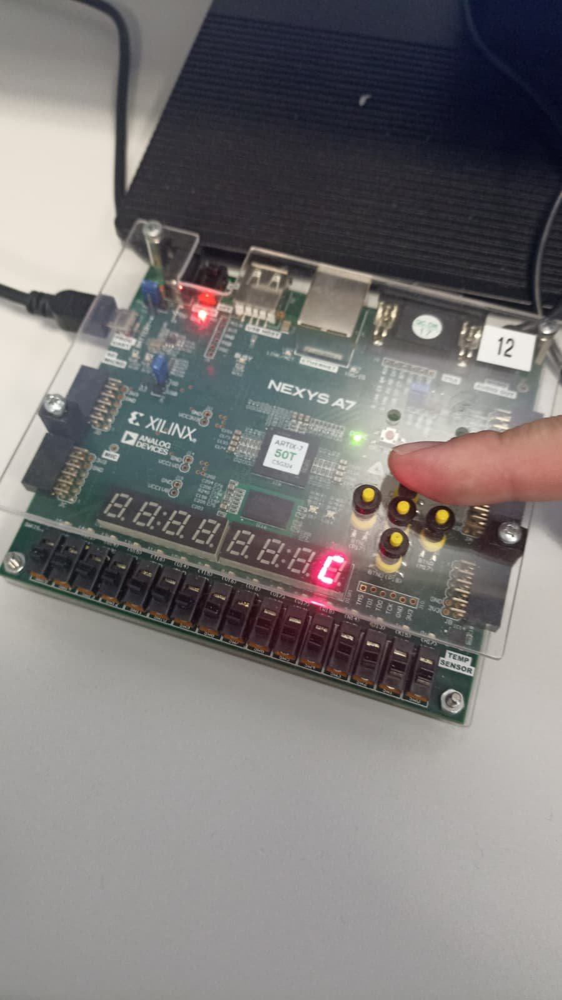

# Ultrasonic Distance Meter using HS-SR04 (FPGA - Nexys A7)

## Project Overview

This project implements a complete ultrasonic distance measurement system using the HS-SR04 sensor on a Xilinx Nexys A7 FPGA board. The system measures distance, displays the result on a 7-segment display, and provides proximity feedback using a buzzer.

The design follows a hierarchical modular architecture, where each functional block is implemented as a separate Verilog module and integrated at the top level.

---

## System Architecture and Interconnection

The system consists of the following main functional stages:

1. Trigger generation  
2. Echo signal capture  
3. Distance computation  
4. Measurement control (FSM)  
5. Output handling (display + buzzer)

### Data Flow

- The system starts a measurement using the `measurement_control` FSM
- `hs_sr04_trigger` generates a 10 µs pulse (TRIG)
- The ultrasonic sensor sends back an ECHO pulse
- `sr04_echo_capture` measures the duration of the ECHO pulse
- `distance_converter` converts this duration to distance (cm)
- The result is:
  - Displayed on 7-segment display (`display_driver`)
  - Used to drive buzzer behavior (`buzzer_control`)

---

## Top-Level Module I/O Description

### Inputs

| Signal | Description |
|------|------------|
| `clk` | 100 MHz system clock |
| `btnu` | Reset signal (active high) |
| `btnd` | Hold mode button |
| `echo` | Echo signal from ultrasonic sensor |

### Outputs

| Signal | Description |
|------|------------|
| `trig` | Trigger signal to ultrasonic sensor |
| `buzzer` | Buzzer output |
| `seg[6:0]` | 7-segment display cathodes |
| `an[7:0]` | 7-segment display anodes |
| `dp` | Decimal point |
| `led[3:0]` | Status indicators |

### LED Mapping

| LED | Meaning |
|-----|--------|
| LED0 | Measuring active |
| LED1 | Hold mode active |
| LED2 | Valid measurement |
| LED3 | Timeout occurred |

---

## Module Implementation

All modules are implemented inside the Vivado project and connected hierarchically.

| Module | Function | Source |
|---|---|---|
| `ultrasonic_top` | Top-level integration of all modules | [`ultrasonic_top.v`](vivado/ultrasonic_1.srcs/sources_1/new/ultrasonic_top.v) |
| `hs_sr04_trigger` | Generates 10 µs trigger pulse | [`hs_sr04_trigger.v`](vivado/ultrasonic_1.srcs/sources_1/new/hs_sr04_trigger.v) |
| `sr04_echo_capture` | Measures echo pulse duration and detects timeout | [`sr04_echo_capture.v`](vivado/ultrasonic_1.srcs/sources_1/new/sr04_echo_capture.v) |
| `distance_converter` | Converts echo cycles to distance (cm) | [`distance_converter.v`](vivado/ultrasonic_1.srcs/sources_1/new/distance_converter.v) |
| `measurement_control` | FSM controlling measurement process | [`measurement_control.v`](vivado/ultrasonic_1.srcs/sources_1/new/measurement_control.v) |
| `display_driver` | Drives multiplexed 7-segment display | [`display_driver.v`](vivado/ultrasonic_1.srcs/sources_1/new/display_driver.v) |
| `buzzer_control` | Generates distance-based buzzer signal | [`buzzer_control.v`](vivado/ultrasonic_1.srcs/sources_1/new/buzzer_control.v) |
| `debounce` | Removes button noise | [`debounce.v`](vivado/ultrasonic_1.srcs/sources_1/new/debounce.v) |
| `clk_en` | Generates slower clock enable signals | [`clk_en.v`](vivado/ultrasonic_1.srcs/sources_1/new/clk_en.v) |
| `counter` | Parameterized counter | [`counter.v`](vivado/ultrasonic_1.srcs/sources_1/new/counter.v) |
| `bin2seg` | Binary to 7-segment conversion | [`bin2seg.v`](vivado/ultrasonic_1.srcs/sources_1/new/bin2seg.v) |

---

## Simulation

Due to hardware limitations on the personal computer, initial simulations were performed using an online EDA simulator.

EDA simulation testbenches can be accessed here:

`eda_simulation_tb_codes/`

Each module was individually tested and verified.

Afterwards, all modules were simulated again in Vivado environment, and finally the complete system (top-level module) was verified.

### Top-Level Vivado Simulation

---

## Module-Level Simulation Results

Detailed simulation waveforms for each module are available in:

`images/README.md`

These include:

- Trigger generation behavior
- Echo capture timing
- Distance conversion correctness
- FSM transitions
- Display multiplexing
- Buzzer timing response

---

## Hardware Implementation

The Vivado project is fully included in this repository:

`vivado/`

It contains:
- Source files
- Constraints file (XDC)
- Simulation files
- Project file (.xpr)

Bitstream generation and FPGA programming were successfully completed.

---

## Physical Implementation

### FPGA Test (Without External Components)

The system was tested on the Nexys A7 board without external sensor connection to verify:

- FSM behavior
- Display functionality
- Button handling
- Internal signal correctness

### Wiring Diagram

This diagram shows how:

- HS-SR04 sensor
- Logic level converter
- External 5V supply (Arduino)
- Buzzer

are connected to the FPGA.

---

## Weekly Progress

### Week 1
- Project scope defined
- Initial system architecture designed
- First schematic created
- Module breakdown planned

### Week 2
- All core modules implemented
- FSM designed
- Interface modules developed

### Week 3
- All modules simulated individually
- Top-level simulation completed
- Vivado project created
- Bitstream generated and uploaded
- FPGA tested without external components

---

## Notes on Ultrasonic Sensor Integration

- Sensor operates at 5V
- FPGA operates at 3.3V
- Logic level converter is required for ECHO signal
- TRIG signal (3.3V) is sufficient for sensor input

---

## Conclusion

The project successfully demonstrates a complete FPGA-based ultrasonic distance measurement system with:

- Modular design
- FSM-based control
- Real-time display output
- Hardware-ready architecture

All modules are tested, integrated, and validated both in simulation and on FPGA hardware.
