# Ultrasound Distance Meter with HS-SR04 on Nexys A7-50T

This project was developed as part of the **BPA-DEL (Digital Electronics)** course at Brno University of Technology in the 2025/2026 academic year by Yusuf Çetin ONARAN and  Niloofar Malekimoghaddam. The goal of the project is to design and implement a real-time distance measurement system using an ultrasonic sensor on an FPGA platform.

The system utilizes the **HS-SR04 ultrasonic sensor** to measure the distance to an object based on the Time-of-Flight (ToF) principle. The measured distance is processed on the **Nexys A7-50T FPGA**, displayed on 7-segment displays, and used to control a buzzer for proximity indication. The design follows a modular and fully synchronous architecture implemented in Verilog.


## Background: Time-of-Flight Principle

Time-of-Flight (ToF) is a distance measurement method based on calculating the travel time of a wave between a transmitter and a receiver. In ultrasonic sensing systems, high-frequency sound waves are emitted, reflected from an object, and received back by the sensor.

The HC-SR04 ultrasonic module operates using this principle. It emits an ultrasonic pulse at approximately 40 kHz and measures the time required for the echo signal to return.

The fundamental relationship used for distance calculation is:

Distance formula:

    distance = (v × t) / 2

where:
- v = speed of sound
- t = echo round-trip time

The division by 2 is required because the signal travels to the object and back.

In this project, the FPGA measures the duration of the ECHO signal in clock cycles. Given a system clock frequency of 100 MHz:

The measured time is derived from the echo counter value:

    t = echo_count / (100 × 10^6)

Based on this, the distance can be approximated in centimeters as:

    distance_cm ≈ echo_count / 5800

This approximation is used in the `distance_converter` module for efficient hardware implementation.

### Ultrasonic Measurement Principle

<p align="center">
  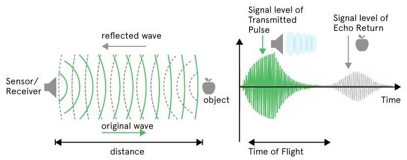
</p>
This figure [1] illustrates the propagation of ultrasonic waves from the sensor to an object and back. The distance is calculated based on the time difference between the transmitted and received signals.


### HC-SR04 Timing Diagram

<p align="center">
  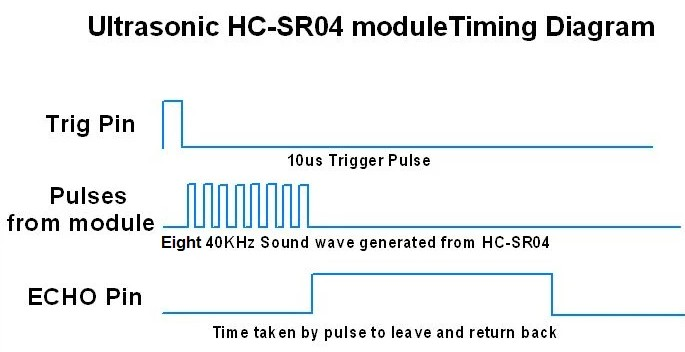
</p>

The timing diagram [2] shows the required 10 µs trigger pulse and the corresponding echo pulse width, which directly encodes the measured distance.

This method provides a simple, low-cost, and robust solution for real-time distance measurement in embedded systems. 


## Project Description

The objective of this project is to design and implement a real-time distance measurement system using the **HS-SR04 ultrasonic sensor** and an FPGA platform.

The system operates by generating a trigger pulse, capturing the duration of the returned echo signal, and converting this time measurement into distance using a hardware-efficient approximation. The computed distance is then displayed on the **7-segment display** of the Nexys A7-50T board.

In addition to distance visualization, the system includes a **buzzer control mechanism** that provides proximity-based feedback, where the buzzer frequency increases as the measured distance decreases. A **hold function** is also implemented using a debounced push-button input, allowing the user to freeze the last valid measurement on the display. 


The design follows a **modular and hierarchical architecture**, where each functional block (trigger generation, echo capture, distance conversion, display control, and system control) is implemented as an independent Verilog module. The entire system is designed using a **single synchronous clock domain (100 MHz)**, avoiding the use of derived clocks and preventing unintended latch inference.

All modules are verified through simulation before integration, and the complete system is synthesized and implemented on the FPGA, ensuring correct operation in both simulation and real hardware.

## System Architecture and Dataflow

The system is designed using a modular and hierarchical architecture. The following block diagram illustrates the high-level structure and signal flow between modules.

<p align="center">
  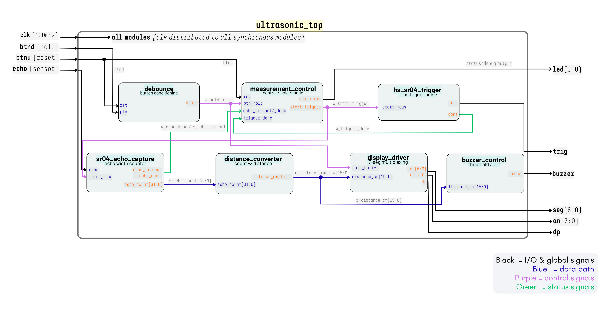
</p>

This diagram presents a simplified view of the system, focusing on the main functional blocks and their interactions.


The view of internal signal connections and synthesized logic, the Vivado-generated dataflow schematic is shown below.

<p align="center">
  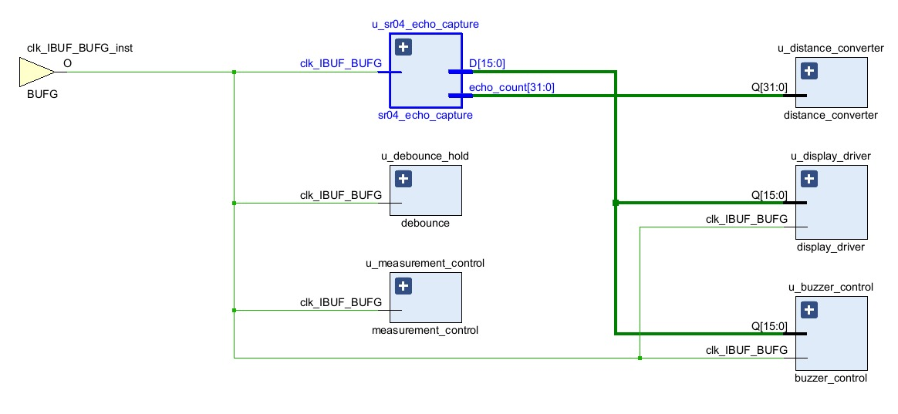
</p>

The overall dataflow of the system is as follows:

1. **Trigger Generation**  
   The `hs_sr04_trigger` module generates a 10 µs pulse.

2. **Echo Capture**  
   The `sr04_echo_capture` module measures echo duration using a counter.

3. **Distance Conversion**  
   The `distance_converter` computes distance in centimeters.

4. **Control Logic**  
   The `measurement_control` module coordinates the process.

5. **Output Stage**  
   - `display_driver` → 7-segment output  
   - `buzzer_control` → audio feedback  
   - `debounce` → stable button input


## Module Interconnection

This section describes the signal-level connections between modules and how data propagates through the system during operation.

At the core of the design is a synchronous pipeline driven by the 100 MHz system clock. All modules operate within the same clock domain to ensure timing consistency and avoid metastability issues.

### Signal Flow Overview

The interconnection between modules follows a structured sequence:

1. **Trigger Control Path**
   - The `measurement_control` module generates the `start_trigger` signal.
   - This signal is connected to the `hs_sr04_trigger` module.
   - The trigger module outputs a `trig` pulse to the ultrasonic sensor and asserts a `trigger_done` signal upon completion.

2. **Echo Measurement Path**
   - The ultrasonic sensor returns an `echo` signal.
   - This signal is fed into the `sr04_echo_capture` module.
   - The module measures the duration of the echo pulse and produces:
     - `echo_count[31:0]` → raw measurement value  
     - `echo_done` → indicates successful measurement  
     - `echo_timeout` → indicates no echo received within time limit  

3. **Distance Calculation Path**
   - The `echo_count[31:0]` signal is passed to the `distance_converter` module.
   - The converter computes the distance in centimeters:
     - `distance_cm[15:0]`

4. **Control Feedback Loop**
   - The `measurement_control` module receives:
     - `trigger_done`
     - `echo_done`
     - `echo_timeout`
   - Based on these signals, it transitions between measurement states and controls the measurement cycle.

5. **Data Latching and Hold Function**
   - The `debounce` module processes the push-button input (`btnd`) to eliminate noise.
   - The debounced signal (`hold_active`) determines whether the displayed value should be updated or frozen.
   - A register stage stores the last valid `distance_cm` value when hold is active.

6. **Output Stage**
   - The `distance_cm[15:0]` signal is distributed to:
     - `display_driver` → drives `seg[6:0]`, `an[7:0]`, `dp`
     - `buzzer_control` → generates `buzzer` output based on distance thresholds

### Design Characteristics

- **Single Clock Domain:**  
  All modules are synchronized using the same clock signal (`clk`), avoiding clock domain crossing issues.

- **Handshake-Based Control:**  
  The system uses control signals (`trigger_done`, `echo_done`, `echo_timeout`) to ensure proper sequencing of operations.

- **Modular Design:**  
  Each module is independent and testable, enabling easier debugging and simulation.

- **Pipeline Dataflow:**  
  Data flows sequentially from measurement → processing → output without unnecessary feedback loops.

This structured interconnection ensures reliable operation, clear signal propagation, and maintainable system design.


## Top-Level Interface

The `ultrasonic_top` module represents the top-level entity of the system. It connects the FPGA board inputs/outputs with all internal modules.

### Port Description

| Signal Name | Direction | Width | Description |
|------------|----------|-------|------------|
| `clk`      | Input    | 1     | 100 MHz system clock |
| `btnu`     | Input    | 1     | Reset button (active-high) |
| `btnd`     | Input    | 1     | Hold button (freeze displayed value) |
| `echo`     | Input    | 1     | Echo signal from HC-SR04 sensor |
| `trig`     | Output   | 1     | Trigger pulse to HC-SR04 sensor |
| `seg[6:0]` | Output   | 7     | 7-segment display segments (active-low) |
| `an[7:0]`  | Output   | 8     | 7-segment display digit enable (active-low) |
| `dp`       | Output   | 1     | Decimal point (not used, kept inactive) |
| `buzzer`   | Output   | 1     | Audio feedback output |
| `led[3:0]` | Output   | 4     | Status/debug LEDs |

### Interface Description

- **Clock Input (`clk`)**  
  The entire system operates synchronously using the onboard 100 MHz clock of the Nexys A7-50T FPGA.

- **Control Inputs (`btnu`, `btnd`)**  
  - `btnu` resets the system and initializes all modules.  
  - `btnd` activates the hold function, freezing the displayed distance.

- **Ultrasonic Sensor Interface (`trig`, `echo`)**  
  - `trig` sends a 10 µs pulse to start measurement.  
  - `echo` receives the reflected signal from the object.

- **Display Outputs (`seg`, `an`, `dp`)**  
  These signals drive the 8-digit 7-segment display using time-multiplexing.

- **Buzzer Output (`buzzer`)**  
  Generates sound based on distance thresholds (closer object → faster beeping).

- **LED Outputs (`led`)**  
  Used for debugging and indicating system states (e.g., measuring, valid data, hold mode).

### Design Note

All external signals are mapped to FPGA pins using the provided `.xdc` constraints file:

- [nexys.xdc](vivado/ultrasonic_1.srcs/constrs_1/new/nexys.xdc)
This ensures correct physical mapping between the FPGA and external peripherals on the Nexys A7-50T board.

## Source Files

The project is implemented using a modular Verilog structure. Each module has a specific responsibility and is connected through the `ultrasonic_top` top-level module.

| Module | Origin / Status | Description | Source |
|---|---|---|---|
| `ultrasonic_top` | Custom top-level module | Integrates all modules and connects the design to Nexys A7 inputs/outputs. | [ultrasonic_top.v](vivado/ultrasonic_1.srcs/sources_1/new/ultrasonic_top.v) |
| `measurement_control` | Custom project module | FSM controlling trigger generation, echo capture flow, hold mode, valid data, and measurement interval. | [measurement_control.v](vivado/ultrasonic_1.srcs/sources_1/new/measurement_control.v) |
| `hs_sr04_trigger` | Custom project module | Generates the 10 µs trigger pulse required by the HS-SR04 sensor. | [hs_sr04_trigger.v](vivado/ultrasonic_1.srcs/sources_1/new/hs_sr04_trigger.v) |
| `sr04_echo_capture` | Custom project module | Measures echo pulse width, detects echo edges, and handles timeout. | [sr04_echo_capture.v](vivado/ultrasonic_1.srcs/sources_1/new/sr04_echo_capture.v) |
| `distance_converter` | Custom project module | Converts measured echo clock cycles into distance in centimeters. | [distance_converter.v](vivado/ultrasonic_1.srcs/sources_1/new/distance_converter.v) |
| `display_driver` | Custom project module | Drives the 8-digit 7-segment display, shows distance in cm, supports hold indication, invalid-data dashes, blank digits, and the `C` unit character. | [display_driver.v](vivado/ultrasonic_1.srcs/sources_1/new/display_driver.v) |
| `buzzer_control` | Custom project module | Generates distance-dependent acoustic feedback. | [buzzer_control.v](vivado/ultrasonic_1.srcs/sources_1/new/buzzer_control.v) |
| `debounce` | Minor modified course module | Based on the course debouncer. Modified by increasing the sampling interval for hardware use and adding `next_shift` for updated shift-register evaluation. | [debounce.v](vivado/ultrasonic_1.srcs/sources_1/new/debounce.v) |
| `bin2seg` | Reused course module | 4-bit hexadecimal to active-low 7-segment decoder. Functionally identical to the course version. | [bin2seg.v](vivado/ultrasonic_1.srcs/sources_1/new/bin2seg.v) |
| `clk_en` | Reused course module | Generates a one-clock-cycle enable pulse every `MAX` cycles. Functionally identical to the course version. | [clk_en.v](vivado/ultrasonic_1.srcs/sources_1/new/clk_en.v) |
| `counter` | Reused course module | Parameterized synchronous up counter with enable. Functionally identical to the course version. | [counter.v](vivado/ultrasonic_1.srcs/sources_1/new/counter.v) |

### Testbench Files

The following testbenches were used to verify the custom and modified modules before or during integration.

| Testbench | Verified Module | Source |
|---|---|---|
| `ultrasonic_top_tb` | Full top-level integration | [ultrasonic_top_tb.v](eda_simulation_tb_codes/ultrasonic_top_tb.v) |
| `measurement_control_tb` | Measurement FSM behavior | [measurement_control_tb.v](eda_simulation_tb_codes/measurement_control_tb.v) |
| `hs_sr04_trigger_tb` | Trigger pulse generation | [hs_sr04_trigger_tb.v](eda_simulation_tb_codes/hs_sr04_trigger_tb.v) |
| `sr04_echo_capture_tb` | Echo pulse measurement and timeout behavior | [sr04_echo_capture_tb.v](eda_simulation_tb_codes/sr04_echo_capture_tb.v) |
| `distance_converter_tb` | Echo count to distance conversion | [distance_converter_tb.v](eda_simulation_tb_codes/distance_converter_tb.v) |
| `display_driver_tb` | 7-segment display multiplexing and status output | [display_driver_tb.v](eda_simulation_tb_codes/display_driver_tb.v) |
| `buzzer_control_tb` | Distance-based buzzer behavior | [buzzer_control_tb.v](eda_simulation_tb_codes/buzzer_control_tb.v) |

### Reused and Modified Course Modules

The modules `bin2seg`, `clk_en`, and `counter` were reused from the course/lab examples without functional modification.

The `debounce` module is based on the course implementation but includes minor project-specific changes. The sampling interval was adjusted for hardware use, and the `next_shift` signal was added to evaluate the updated shift-register value more clearly.


The `display_driver` module was written specifically for this project. Although it uses the same general multiplexing idea taught in the course, it was extended into a custom 8-digit distance display driver with support for hold indication, invalid measurement indication, blank digits, and centimeter display.

 
## Simulation Results

All custom modules were verified using individual testbenches before full system integration. Most module-level simulations were performed in EDA Playground, while the final top-level verification was also performed in Vivado Simulator.

Detailed simulation explanations and all waveform screenshots are available here:

- [Detailed Simulation Results](images/Simulations.md)

### Representative Simulation Results

#### HS-SR04 Trigger Generation

<p align="center">
  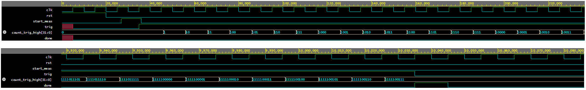
  <br>
  <em>HS-SR04 trigger simulation waveform</em>
</p>

This simulation verifies that the `hs_sr04_trigger` module generates the required trigger pulse after `start_meas` is asserted. The trigger signal remains active for the configured duration, and the `done` signal is generated after the pulse is completed.

#### Echo Capture

<p align="center">
  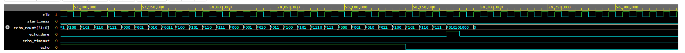
  <br>
  <em>Echo capture simulation waveform</em>
</p>

This simulation verifies that the `sr04_echo_capture` module detects the echo pulse, measures its high duration using `echo_count[31:0]`, and asserts `echo_done` when the pulse ends.

#### Top-Level Vivado Simulation

<p align="center">
  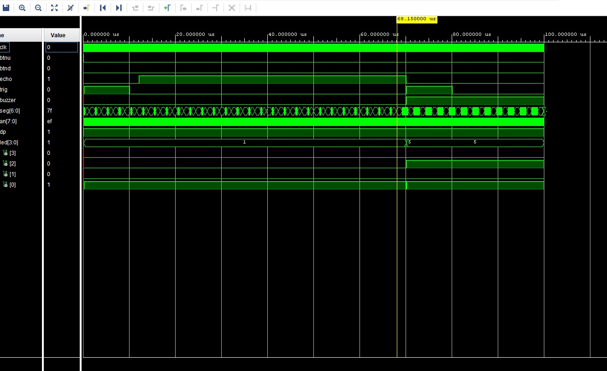
  <br>
  <em>Top-level Vivado simulation waveform</em>
</p>

The top-level Vivado simulation verifies the integrated behavior of the complete system, including trigger generation, echo capture, distance conversion, display activity, buzzer control, and LED status outputs.

Console output from the top-level simulation:

```text
echo_count  = 5801
raw_dist    = 1
stored_dist = 1
valid_meas  = 1
led         = 0101

PASS: ultrasonic_top measured 1 cm correctly
PASS: hold mode active
```

## FPGA Implementation

The complete design was successfully synthesized, implemented, and deployed on the Nexys A7-50T FPGA board using Vivado 2025.2. The demo video is avaliable here: ---VIDEO LINK WILL BE INSTERTED---

<p align="center">
  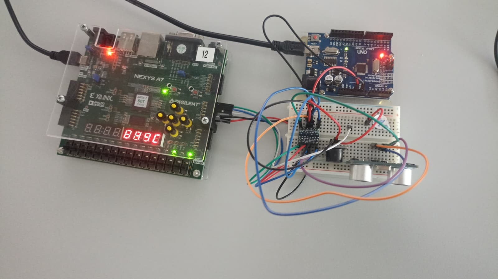
  <br>
  <em>Physical implementation of the ultrasonic distance measurement system</em>
</p>

<p align="center">
  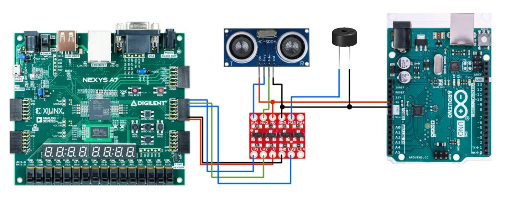
  <br>
  <em>Hardware wiring of the HS-SR04 sensor and FPGA connections</em>
</p>

### Hardware Setup

The system consists of the following hardware components:

- **FPGA Board:** Nexys A7-50T (Artix-7, 100 MHz clock)
- **Sensor:** HC-SR04 Ultrasonic Sensor
- **Power Supply:** External 5V supply for the sensor
- **Interface:** Pmod / direct pin connection with level compatibility

### Operation

1. The FPGA generates a **10 µs trigger pulse** via the `trig` signal.
2. The HC-SR04 sensor emits ultrasonic waves and waits for reflection.
3. The sensor outputs a high signal on the `echo` pin proportional to the distance.
4. The FPGA measures the echo duration and converts it into distance.
5. The result is displayed on the **7-segment display**.
6. The **buzzer output** provides distance-based feedback.

### Measurement Behavior

- Continuous measurement is performed with a fixed interval between readings.
- The **hold button (`btnd`)** freezes the current measured value.
- If no echo is received within the timeout window:
  - The system detects an invalid measurement
  - The display shows placeholder output (e.g., dashes)

### Measurement Interval Tuning

To ensure stable operation and avoid interference between consecutive measurements, a delay is inserted between measurement cycles.

- System clock: **100 MHz**
- Measurement interval: approximately **60 ms**

This corresponds to:

- `6,000,000` clock cycles between measurements

This delay ensures that:
- Echo reflections from previous measurements do not interfere
- The sensor operates within its recommended timing constraints

### Implementation Notes

- The design uses a **single clock domain**, avoiding clock domain crossing issues.
- All timing-sensitive operations (trigger, echo measurement) are handled using counters.
- The system was verified both in simulation and on real hardware.

The successful hardware implementation confirms the correctness and robustness of the overall system design.

## Vivado Reports and Resource Usage

The design was synthesized and analyzed using **Vivado 2025.2** for the Nexys A7-50T target FPGA.

### Resource Utilization

<p align="center">
  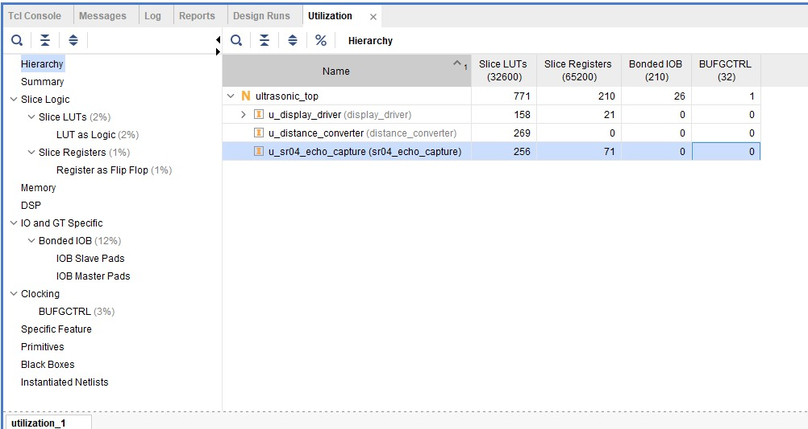
  <br>
  <em>Vivado resource utilization report</em>
</p>

| Resource | Used | Available | Utilization |
|---|---:|---:|---:|
| Slice LUTs | 771 | 32600 | ~2.37% |
| Slice Registers / Flip-Flops | 210 | 65200 | ~0.32% |
| Bonded IOB | 26 | 210 | ~12.38% |
| BUFGCTRL | 1 | 32 | ~3.13% |

The utilization report shows that the design uses only a small portion of the available FPGA resources. The most resource-consuming modules are `distance_converter`, `sr04_echo_capture`, and `display_driver`, mainly because of arithmetic operations, counters, and display multiplexing logic.

### Power Analysis

<p align="center">
  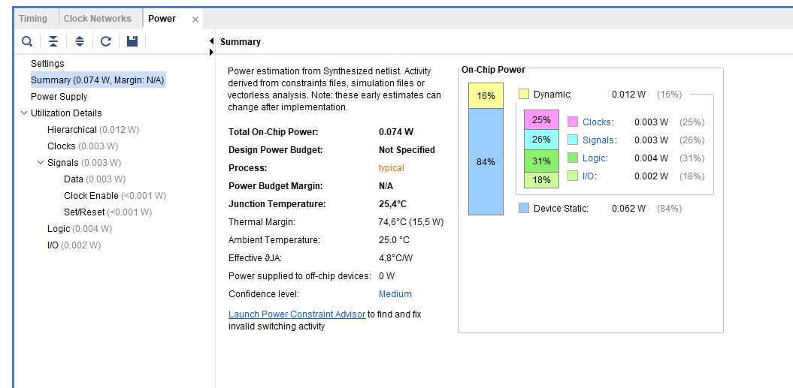
  <br>
  <em>Vivado estimated power consumption report</em>
</p>

| Power Component | Estimated Power |
|---|---:|
| Total On-Chip Power | 0.074 W |
| Dynamic Power | 0.012 W |
| Device Static Power | 0.062 W |
| Clock Power | 0.003 W |
| Signal Power | 0.003 W |
| Logic Power | 0.004 W |
| I/O Power | 0.002 W |

The estimated power consumption is low, which is expected for this project because the design mainly consists of counters, FSM logic, simple arithmetic, and display/buzzer control.


## Project Progress

**Week 1:** The overall project requirements were analyzed and the system architecture was defined. The block diagram and dataflow structure were created, and the Git repository was initialized.

**Week 2:** All core modules were implemented in Verilog and the top-level module (`ultrasonic_top`) was developed. Module interfaces and signal interconnections were finalized.

**Week 3:** Simulations of individual modules and the top-level design were performed and verified. Waveform analysis confirmed correct functionality, and the bitstream was successfully generated in Vivado.

**Week 4:** The physical circuit was assembled using the Nexys A7-50T and HC-SR04 sensor. The bitstream was programmed, real measurements were tested, the measurement interval was tuned for stability, and the final demo video was recorded. 


## Conclusion

In this project, we designed and implemented an ultrasonic distance measurement system using the HC-SR04 sensor on the Nexys A7-50T FPGA. The system works based on the time-of-flight principle, where a trigger signal is sent, the echo duration is measured, and this timing is converted into distance and displayed on 7-segment displays. A buzzer was also added to give additional feedback based on distance.

We followed a modular design approach, where each part of the system was implemented as a separate module. This made it much easier to develop, test, and debug the system step by step. First, we tested each module individually using simulations, and then we integrated everything into the top-level design. This helped us avoid major issues during hardware testing.

During the project, we faced some practical challenges. One of the main difficulties was dealing with the echo signal coming from the sensor, since it is asynchronous. To handle this properly, we used synchronization techniques to avoid unstable behavior. Another challenge was making sure the system does not get stuck if no echo is received, which we solved by adding a timeout mechanism.

We also noticed that taking measurements too frequently caused unstable results. To fix this, we added a delay between consecutive measurements, which improved the overall stability of the system. Adjusting this measurement interval was an important step in getting reliable hardware results.

From a design perspective, we tried to keep everything in a single clock domain and used clock enable signals instead of generating new clocks. This made the design safer and easier to implement in Vivado.

In the end, the system works reliably on the FPGA and produces consistent distance measurements. The resource usage is low, and the system runs efficiently in real time.

Overall, this project helped us better understand how to design, simulate, and implement a complete digital system on FPGA. We also gained experience in debugging, timing considerations, and working with real hardware. In the future, the design could be improved by adding filtering or averaging for more precise measurements, or by extending the system with additional features such as communication interfaces. 


## References and Tools

### References

- Ling, P. (2024, August 7). *Time-of-flight distance measurement enables emerging markets*. Avnet.  
  Available at: https://www.avnet.com/americas/resources/article/time-of-flight-distance-measurement-enables-emerging-markets/ [1]

- ElectronicWings. (n.d.). *HC-SR04 ultrasonic sensor guide with Arduino interfacing*.  
  Available at: https://www.electronicwings.com/sensors-modules/ultrasonic-module-hc-sr04 [2]

- Digilent Inc. (n.d.). *Nexys A7 FPGA Board Reference Manual*.  
  Available at: https://digilent.com/reference/programmable-logic/nexys-a7/reference-manual

- Fryza, T. (n.d.). *Verilog examples repository*.  
  Available at: https://github.com/tomas-fryza/verilog-examples

### Reused Modules

The following modules were reused from the course materials provided by **Tomas Fryza**:

- `bin2seg.v`
- `counter.v`
- `clk_en.v`

These modules were adapted from the official course repository:
https://github.com/tomas-fryza/verilog-examples

### Tools

- **Vivado 2025.2** – Used for simulation, synthesis, implementation, and FPGA programming  
- **EDA Playground** – Used for testing and debugging individual modules  
- **GitHub** – Used for version control and project management 
