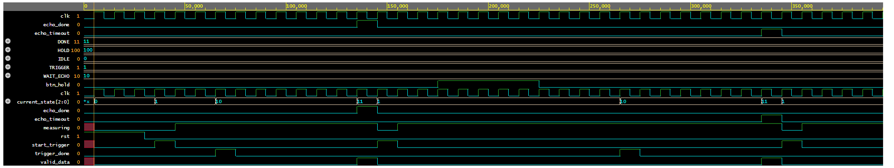
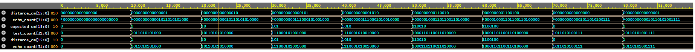
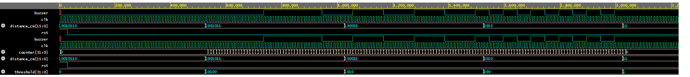
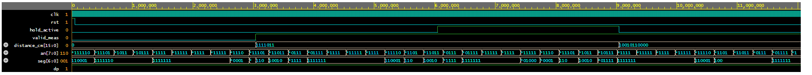
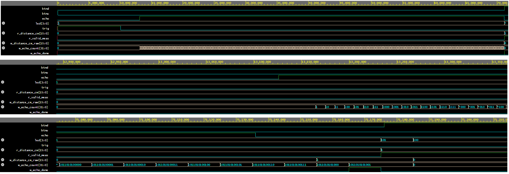

# Simulation and Hardware Results

This folder contains the waveform screenshots, schematic diagrams, wiring diagram, and initial hardware implementation evidence for the **Ultrasound Distance Meter with HS-SR04 on Nexys A7-50T** project.

The purpose of this folder is to document how the design was verified at both module level and top-level integration level.

---

## Module-Level Simulations

The following simulations were performed using EDA Playground. Each custom module was tested separately before being integrated into the top-level design.

---

## `hs_sr04_trigger`


This simulation verifies the trigger generation module. When the `start_meas` input is asserted, the module generates a high pulse on the `trig` output.

For the HS-SR04 sensor, the trigger pulse must be approximately 10 microseconds. Since the FPGA clock is 100 MHz, one clock cycle is 10 ns. Therefore, a 10 microsecond pulse corresponds to 1000 clock cycles.

The simulation confirms that:

- `trig` becomes active after `start_meas`
- the trigger pulse remains high for the required duration
- `done` is generated after the trigger pulse is completed

This module is responsible for starting each ultrasonic measurement.

---

## `sr04_echo_capture`


This simulation verifies the echo measurement module. The module waits for the `echo` signal to rise, counts how long it remains high, and then generates `echo_done` when the falling edge is detected.

The simulation confirms that:

- the module waits for the rising edge of `echo`
- `echo_count[31:0]` increases while `echo` is high
- `echo_done` is asserted when the echo pulse ends
- timeout protection is available through `echo_timeout`

This module is one of the most important parts of the design because the measured echo pulse width is the raw timing information used for distance calculation.

---

## `measurement_control`



This simulation verifies the finite state machine responsible for controlling the measurement sequence.

The `measurement_control` module coordinates the complete measurement process. It starts the trigger generator, waits for the trigger pulse to finish, waits for the echo measurement to complete, and then allows the system to continue or enter hold mode depending on the hold button input.

The simulation confirms the expected control flow:

```text
IDLE -> TRIGGER -> WAIT_ECHO -> DONE -> next measurement / HOLD
```

The important verified signals are:

- `start_trigger`, which starts the ultrasonic measurement
- `trigger_done`, which indicates that the 10 microsecond trigger pulse is completed
- `echo_done`, which indicates that the echo pulse was measured
- `echo_timeout`, which prevents the system from getting stuck if no echo is received
- `measuring`, which indicates that the system is actively measuring
- `valid_data`, which indicates that a measurement result is available

This module acts as the main controller of the ultrasound subsystem.

---

## `distance_converter`



This simulation verifies the conversion from measured echo clock cycles to distance in centimeters.

At 100 MHz:

```text
1 clock cycle = 10 ns
```

For the HC-SR04 / HS-SR04 sensor, the common approximation is:

```text
distance_cm ≈ echo_time_us / 58
```

Since:

```text
echo_time_us = echo_count / 100
```

the implemented conversion is:

```text
distance_cm ≈ echo_count / 5800
```

The simulation confirms that different `echo_count` input values produce the expected `distance_cm` output values.

This module uses integer arithmetic, which is suitable for FPGA implementation and avoids floating-point hardware.

---

## `buzzer_control`



This simulation verifies the distance-dependent buzzer behavior.

The buzzer output changes according to the measured distance. For larger distances, the buzzer remains off or toggles slowly. As the measured distance decreases, the buzzer toggles faster. For very small distances, the buzzer remains continuously active.

The intended behavior is:

```text
distance > 100 cm  -> buzzer off
50 cm < distance <= 100 cm -> slow beeping
20 cm < distance <= 50 cm  -> medium beeping
5 cm  < distance <= 20 cm  -> fast beeping
distance <= 5 cm -> constant buzzer on
```

The simulation confirms that the buzzer output follows the threshold logic implemented in the module.

---

## `display_driver`



This simulation verifies the multiplexed seven-segment display driver.

The Nexys A7 board uses a multiplexed display, meaning that only one digit is enabled at a time, but the active digit changes quickly enough to appear continuous to the human eye.

The simulation confirms that:

- the `an[7:0]` signals scan through the display digits
- the `seg[6:0]` output changes according to the selected digit
- valid measurements are displayed as decimal digits
- invalid measurements are represented using dash characters
- hold mode can be indicated using the `H` character

This module is responsible for displaying the measured distance to the user.

---

## Top-Level Simulations

After individual module verification, the full system was simulated using both EDA Playground and Vivado.

---

## `ultrasonic_top` EDA Playground Simulation



This simulation verifies the integrated system behavior using the `ultrasonic_top` module.

The simulation includes:

- reset behavior
- trigger generation
- simulated echo input
- LED status output
- seven-segment display activity
- buzzer output behavior

The purpose of this simulation is to check whether the individual modules operate correctly after integration. The waveform confirms that the system starts a measurement, receives an echo pulse, updates internal status signals, and drives the output peripherals.

---

## `ultrasonic_top` Vivado Simulation


This simulation was performed using Vivado Simulator.

The Vivado top-level simulation provides additional verification in the same development environment used for synthesis, implementation, and bitstream generation.

The waveform shows:

- the system clock
- reset and button inputs
- generated `trig` output
- simulated `echo` input
- LED debug signals
- seven-segment display outputs

This confirms that the complete design behaves correctly in Vivado before hardware implementation.

---

## Schematic Diagrams

---

## Top-Level Block Diagram


This diagram shows the hierarchical architecture of the project.

The main modules are:

- `debounce`
- `measurement_control`
- `hs_sr04_trigger`
- `sr04_echo_capture`
- `distance_converter`
- `display_driver`
- `buzzer_control`
- `ultrasonic_top`

The diagram also shows the main internal signals, including:

- `w_start_trigger`
- `w_trigger_done`
- `w_echo_done`
- `w_echo_timeout`
- `w_echo_count[31:0]`
- `w_distance_cm_raw[15:0]`
- `r_distance_cm[15:0]`

The diagram separates control signals, status signals, data signals, and external I/O connections.

---

## Physical Wiring Diagram


This diagram shows the planned physical connection between the Nexys A7 board, the HS-SR04 ultrasonic sensor, the logic level converter, the buzzer, and the Arduino used as a 5V power source.

The HS-SR04 sensor uses 5V logic, while the Nexys A7 FPGA I/O pins use 3.3V logic. Therefore, the echo signal from the sensor must pass through a logic level converter before reaching the FPGA.

The intended connections are:

```text
Nexys JA1 / trig  -> HS-SR04 TRIG
HS-SR04 ECHO      -> level converter HV side
level converter LV side -> Nexys JA2 / echo
Nexys JA3 / buzzer -> buzzer signal
Arduino 5V        -> HS-SR04 VCC and level converter HV
Nexys 3.3V        -> level converter LV
Common GND        -> Nexys, Arduino, sensor, level converter, buzzer
```

The most important safety point is that the HS-SR04 `ECHO` pin must not be connected directly to the Nexys A7 input pin because it can output 5V.

---

## Initial Hardware Implementation


This image shows the design programmed onto the Nexys A7-50T board.

During the available lab time, the bitstream was successfully generated and loaded onto the FPGA. A basic hardware check was performed without the ultrasonic sensor connected. The reset button behavior and onboard display/LED activity were observed.

This confirms that:

- the Vivado bitstream was successfully generated
- the FPGA was programmed correctly
- the top-level design was active on the board
- basic reset/display behavior could be observed

Full sensor-based hardware testing with the HS-SR04 module and buzzer was not completed during the lab session due to time limitations.

---

## Summary

The project was verified in several stages:

1. Individual custom modules were simulated separately.
2. The complete top-level system was simulated.
3. Vivado simulation was performed before implementation.
4. The bitstream was generated and programmed onto the Nexys A7-50T board.
5. Initial hardware behavior was observed on the FPGA board.

These results demonstrate that the design was developed, simulated, integrated, and initially implemented using a structured FPGA design workflow.
